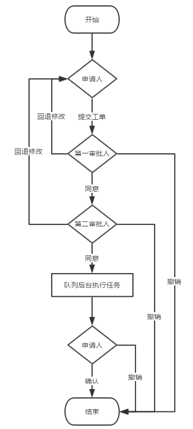
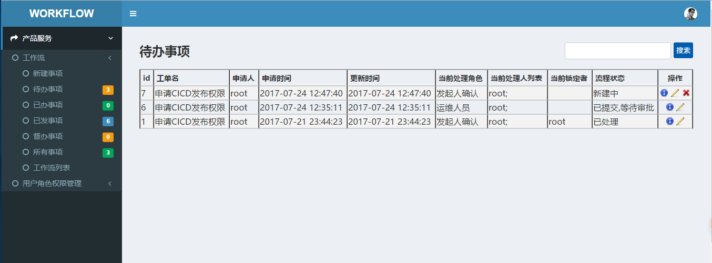

# OP-workflow

运维工作流，主要目的是解放运维人员工作，统一操作规范，减少沟通成本，降低操作失误率，量化运维工作，总之，工作流对于运维人员很重要！<br>
本系统是使用Python, Django开发的，一般公司工作流都是由运维开发来实现各种工作流需求，本系统可以让运维人员快速创建工作流。

### 部署运行环境
* Centos6.5 x86_64
* Python2.7
* Virtualenv
* Django1.9.2
* Rabbitmq-server

### 流程图


### 安装部署

```
cd op-workflow
sh update_python2.7.8.sh 
yum install rabbitmq-server -y
/etc/init.d/rabbitmq-server start
chkconfig rabbitmq-server on
pip install virtualenv
virtualenv ./env
source env/bin/activate
pip install -r pip_requirements.txt
python manage.py makemigrations
python manage.py migrate
python manage.py createsuperuser #创建超级管理员
python init.py
vim mysite/settings.py #手动修改配置SYS_API和EMAIL配置等
sh service.sh start
```

### 使用
1. 访问http://你的主机IP:8000
2. 添加系统用户及工作流审批角色
  * 添加系统用户：用超级管理员账号登录系统 点击右上角用户图标 --> 后台中心 --> 点击用户表添加用户(邮箱地址和姓氏必须填，注意：姓氏填姓名全名)
  * 添加工作流管理员和督办员成员：用户角色权限管理 --> 用户角色列表 --> 编辑工作流管理员和工作流督办员
  * 添加审批角色：用户角色权限管理 --> 用户角色列表 --> 添加角色
3. 创建工作流
  * 创建免审批工作流: 工作流 --> 工作流列表 --> 添加工作流 --> 不添加审批流程点击提交 --> 按说明修改对应文件
  * 创建审批工作流：工作流 --> 工作流列表 --> 添加工作流 --> 添加审批流程点击提交 --> 按说明修改对应文件
4. 工单申请及审批
  

### 截图



